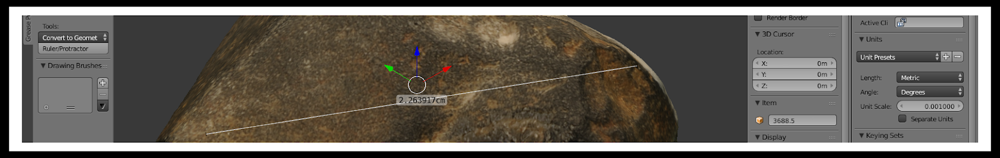
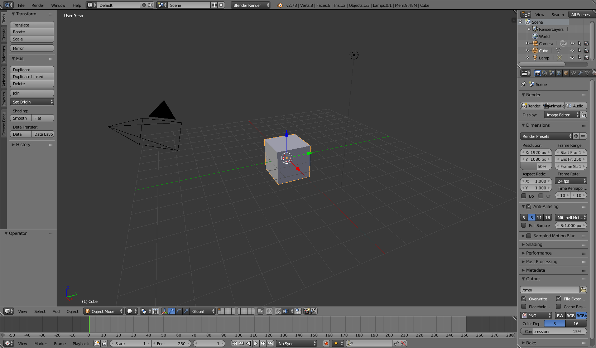
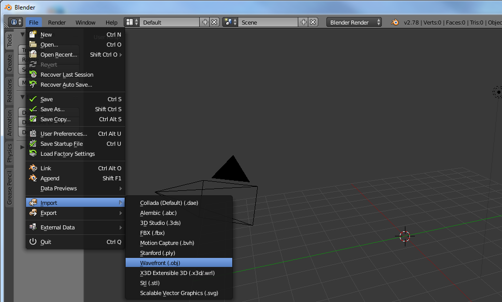
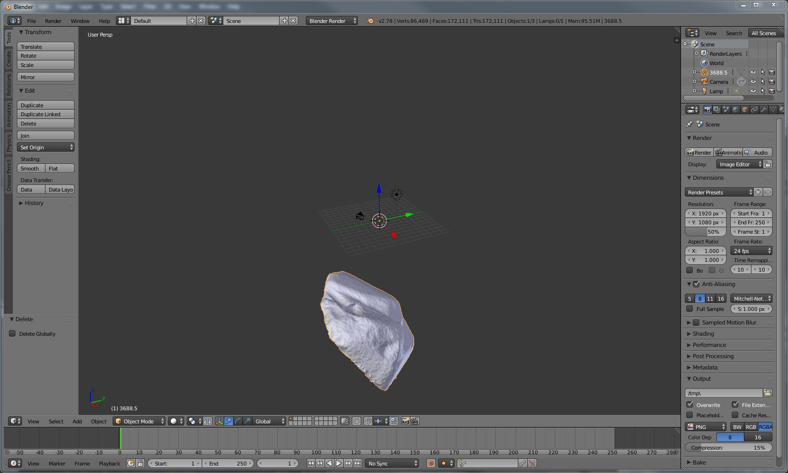
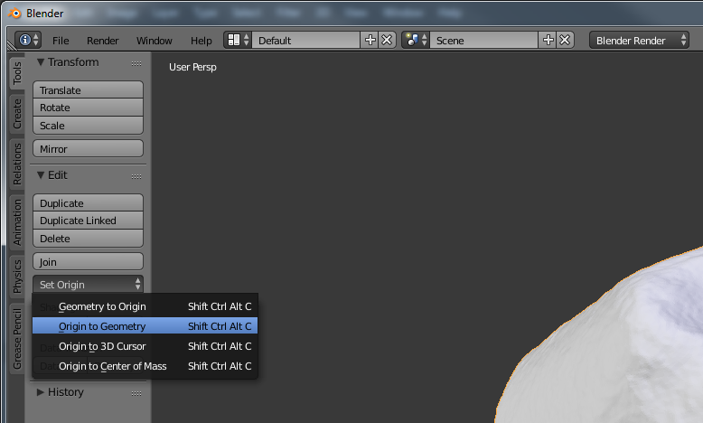
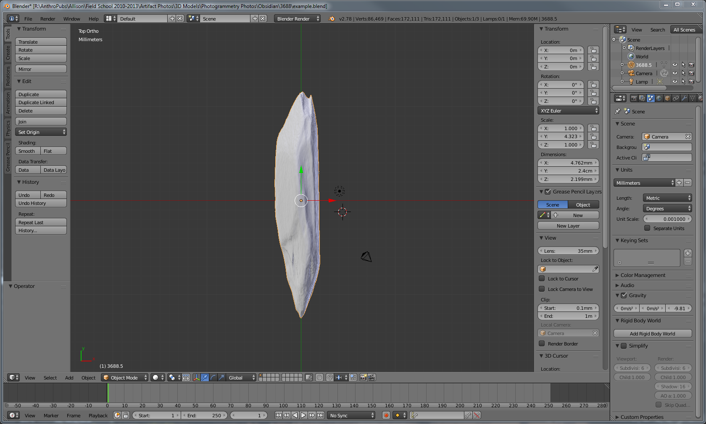

This tutorial demonstrates how to accurately size a 3D model using the open source software [Blender](https://www.blender.org/).

<!--more-->

You will need a 3D model in a common file format (I use OBJs) and the measurement of the longest axis of the object. Once you become familiar with this process it will only take a couple minutes to complete.

3D models are great for measurements that are difficult to obtain from physical objects, but first the 3D model itself must be the right size. Many laser scanners or structured-light scanners automatically scale the object, but often models created using photogrammetry lack a true scale. Whatever the reason you need a 3D object scaled to the right size, this tutorial will show you a simple method using Blender.  

I've chosen Blender as it is free and comes with no restrictions. The software can be used to create an animated movie from scratch or
design a 3D game, but it can be  overwhelming at first. Blender has a large community and many free tutorials if you would like to become more familiar with the basics or expand your knowledge. This tutorial is designed for the Blender beginner, but I generally will only cover Blender basics related to this process.
  

## Step 1 - Remove cube 

If you have the default setup for Blender, then the first step is to remove the default cube. This is done by first selecting the object.
Right click on the cube and it will be outlined in orange. Then, with the mouse inside the *3D View* window (keyboard shortcuts only work if the mouse is hovering in the right area), press *X* or the delete key. A menu will appear, click delete.

## Step 2 - Import 3D model

The next step is to import the 3D model (this tutorial uses OBJ, but is similar for other file types). Select the following from the menu: File&rarr;Import&rarr;Wavefront (.obj).

Warning! it make take some time to load if the model is large (you may consider decimating the model in the program used to create it or by using Blender itself).

## Step 3 - Adjust orientation

Once the object is loaded it should appear in the view screen. Occasionally the object will not be visible, either due to its small size or that the 3D model is located far from the [origin](https://docs.blender.org/manual/en/dev/editors/3dview/object/origin.html). The easiest way to find the model is to press **.** on the numpad (note that only the numpad can be used for navigation unless changed in the Blender settings). Another method is to use the toolbar on the bottom of the *3D View* window (the lowest screen is defaulted to the timeline window and selections from this toolbar will not affect the 3D view; see a general Blender tutorial for more details). Select *View&rarr;Align View&rarr;View* selected to view the object. This only works on the selected object. Another way to select an object is to use the *Outliner* window located in the top right of the default window. Any object in this window can be selected by left-clicking it.

If the imported object looks correct, then next we adjust the origin to make the object easier to manage (assuming the 3D model isn't tied to a meaningful origin point [it usually isn't]). The orientation of the selected object can be changed using the *Tool Shelf*. This panel can be viewed/hidden by pressing *T* on the keyboard. The first tab on the *Tool Shelf* is labeled *Tools*. Select *set origin* and a menu will appear. Select the first option (*Geometry to Origin*). This will move the object to the center (use **.** on the numpad to reorient the *3D Viewer*).

Next we will rotate the object. This step is critical as the orientation of the object will be used for sizing the object. *R* on the keyboard is used to rotate the object. I find it easiest to rotate one axis at a time. Limit the rotation by pressing *R* and then *X*, *Y*, or *Z*. There is no need to hold down keys when executing sequences on the keyboard. Simply press *R* once, then press *X* once. Changing the view will help with orienting the object. First change the view to ortho by pressing *5* on the numpad (while I will be using keyboard shortcuts the corresponding navigation options are under the *View* menu at the bottom of the *3D View* screen). Next, move to *Front* view by pressing *1* on the numpad. Rotate the object using the keyboard shortcuts above until the objects looks as it should when viewed from the front. Move the mouse in a circle to rotate it and use the shift key to make fine adjustments. Repeat this step for the side view (3 on the numpad) and top view (7 on the numpad). You can view the opposite side by holding down *Ctrl*. For example, press *Ctrl-T* to see the bottom view. You may need to move between the views several times to properly orient the object. Remember to limit the rotation to one axis to avoid changing previously oriented axes. We will scale the object along its longest axis. To do this the longest axis must be aligned directly to the *X*, *Y*, or *Z* axis. I use the *Y* axis in this tutorial.

In the above screenshot the edge of the object farthest above and below the *X* axis are directly aligned. The green line is the Y axis running through these points. The screenshot shows the top view (7 on the numpad). The *Y* axis is aligned with the location of the measurement taken from the physical object. The axis lines are a good way to align the model. Drag the arrows in the direction you want to move the object so the longest axis is aligned with the chosen axis (you can also move the object free-form by pressing *G* and then left-clicking to place the object).

The last step in orienting the object is to apply the changes. Failing to apply the changes will mess up the next step. Press *Ctrl-A* and a menu will appear. Select *Rotation & Scale*. I also like to apply the *Location* as well, although this is not necessary.

## Step 4 - Scaling

Blender does not use real world measurements by default. To change this, first select *Scene* on the properties window located by default on the far right (the icon has a sun, globe, and cylinder). In the *Units* section select *Unit Presets* (as shown in the screenshot above) and select *Millimeters*. Any unit can be used if desired, but millimeter is the default unit for *STLs*, which is the most commonly used file type for 3D printing. After changing the scene unit the dimensions will now have *mm*. 

In the screenshot above the dimensions are shown in the *properties panel*. This is different from the *properties window* on the right (I know it's confusing). If you do not see this tab press *N*. This panel has a lot of useful information about the selected object, and most of these attributes can be directly modified on this panel. The *Rotation* values should all be 0° and the scale values should all be 1. If this is not the case, then please see the last part of **Step 3**. 

To scale the object simply enter the measurement value **in millimeters** on the appropriate axis. In my example I have aligned the model so that my physical measurement is directly along the *Y* axis. The method I demonstrate only works if this is the maximum *Y* length. In my example, the *Y* axis is currently showing as 5.551 mm. If part of the model extends further along the Y axis then what I measured the scaling will be off.

In the above screenshot, I entered 24mm into the *Dimensions* box, which is the physical measurement I made. Note that this distorts the model. The *Scale* now reads 4.323 in the *Y* axis box. Copy and paste the *Y* scale to the *X* and *Z* boxes  using the keyboard shortcuts *Ctrl-C* and *Ctrl-V*. You will see that the model is no longer distorted.

The **final** step is to apply these changes. Press *Ctrl_A* and apply the *Scale*. The values in the *Scale* box will now read 1. Now any measurements made on this model will be correct.

Next you may want to measure something. Here's a link to get you started --- [Ruler & Protractor](https://docs.blender.org/manual/en/dev/interface/ruler_protractor.html).

Thanks for reading the tutorial and feel free to comment below or [email me](bischrob@gmail.com) if you have any questions, or if you have any suggestions on improving this process.
