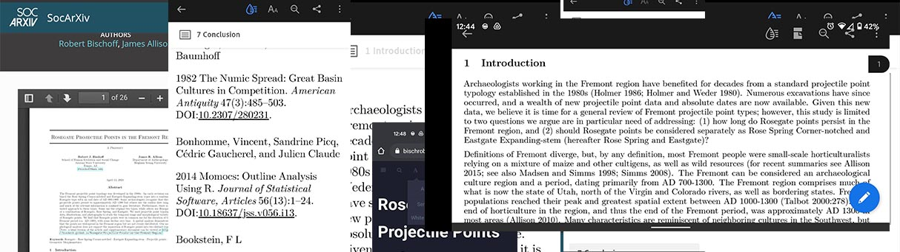
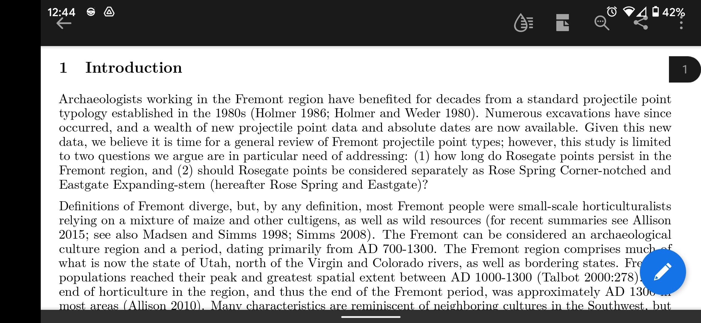
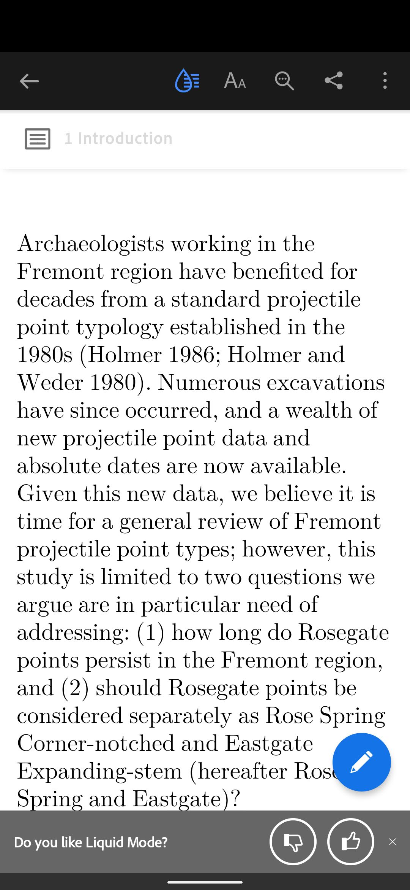
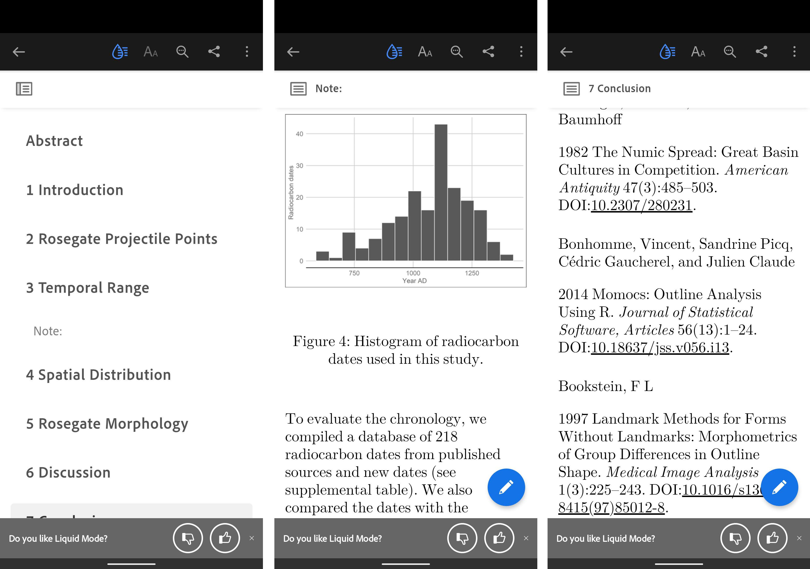
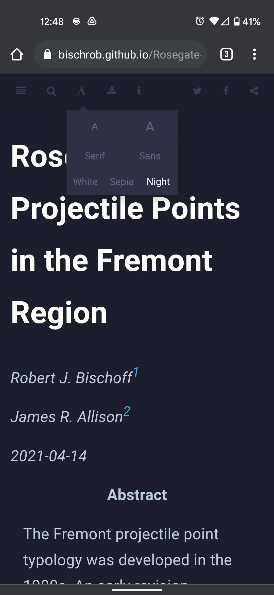

I love reading on my phone. Why? Because it is convenient. Books are great, but they usually require using both my hands, and that's a lot of work. Even worse, I have to carry the book around. It's been a long time since I walked around with a novel in my pocket in case I got bored. Reading on a computer is ok, but it's not my favorite. I usually read e-books or html content like news and blogs on my phone. Keeping up with the latest archaeology articles and books is a lot harder though. I often feel like I should be spending a lot more time keeping up with the ever-growing literature I need to keep track of. Academic books aren't very portable but most of my reading is done with pdfs. For a format that is literally a "portable document format," pdfs aren't that easy to read on a phone. Apparently I'm not alone in thinking this:

<!--more-->

> Reading documents --- particularly PDFs --- on mobile has never been a stellar experience. According to Adobe's own research, 65% of people in the U.S. find it frustrating and 45% stopped reading or didn't try [1].

I'm writing this because I've found that if it is too much of a pain to read an article on my phone, then I usually won't do it unless I have to. This brings me to Adobe's liquid mode on their mobile Acrobat Reader app. I love Adobe's products and am lucky to have a subscription but this feature is fortunately free for those who do not have an Adobe subscription.

{width="585"}

I usually will try to read a pdf in landscape view to try and maximize the screen, but moving your eyes this much slows down reading a lot. Liquid mode is an option at the top of the app that uses Adobe's Sensei AI to try to convert the pdf to what is essentially an e-book view.

{width="222"}

Now I can adjust the text size however I want and view an autogenerated table of contents for navigation. Even the figures and references look nicely formatted.

{width="682"}

As with everything, there are some limitations. Large files aren't supported (200 pages is what the app currently says). Scanned pdfs usually don't work either. I've been pleasantly surprised with how well it works, but there are still plenty of formatting issues where text appears out of place or bullet points are improperly located.

It's easier though if we don't have to deal with pdfs in the first place. Many publishers offer html versions of their journal articles. I love this for open source articles but I am hesitant for publishers that require a subscription. First, I have to log in through my institution to even get to the article, which can sometimes be quite the pain. Second, I'm worried I'll lose access to the article so I just download the pdf anyway.

I'm a big fan of open source, and I love the idea of preprints. My [first preprint](https://osf.io/preprints/socarxiv/dwrba/) is now online, but one problem with the preprint server is that I have to upload a pdf. Liquid mode is one solution to this problem, but I wanted to try to improve the reading experience for my preprint. In the abstract of the preprint I placed a [link](https://bischrob.github.io/Rosegate-Projectile-Points-in-the-Fremont-Region/) to a [bookdown](https://bookdown.org/) version of the combined article and supplemental files. Bookdown is a way to write books or articles that can be converted to html, pdf, or epub formats. This was my first attempt at using bookdown and I ran into a few problems, but overall I think it is a great way to improve mobile access.

{width="222"}

Bookdown allows you to easily navigate the document, download a pdf or epub version, change the text size, and even change to sepia or night mode.

I am a huge fan of liquid mode and I've already used it to increase my reading productivity, but I also want to encourage authors to consider ease of access in their publishing. Reducing mobile phone usage is a worthy goal, but so is reading the latest preprints while waiting in line at the grocery store.

Let me know in the comments if you have any tips for reading productively.

1 Wiggers, Kyle 2020 Adobe's Liquid Mode Leverages AI to Reformat PDFs for Mobile Devices. *VentureBeat*. <https://venturebeat.com/2020/09/23/adobes-liquid-mode-leverages-ai-to-reformat-pdfs-for-mobile-devices/,> accessed May 8, 2021.
